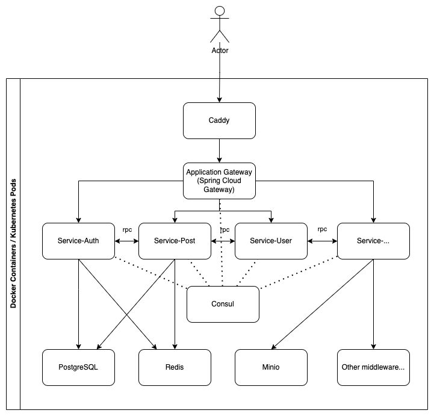

# 什么是 NeraBBS？

NeraBBS 是一款基于 Java 21 和 Vue 3 构建的，采用 Material 3 页面风格的云原生微服务轻论坛程序。您可以通过此项目快速的了解微服务程序的构造、前端工程化的落地、最新技术栈和语法的使用等知识。

> [!TIP]
> 迫不及待想部署试试了？请转到[快速开始](./getting-started)。

## 特性

### 后端

- 无状态微服务架构自动服务发现 + gRPC 负载均衡
- 单机（Docker-Compose）+ 多节点（kubernetes）容器编排
- 自动 CI/CD（GitHub Actions）服务部署
- Gradle 多模块应用 + Version Catalogs 声明式依赖管理
- Java 21 虚拟线程、模式匹配语法支持
- 基于 HTTP 响应码的错误码返回 + 统一化错误处理
- Spring Data JPA ORM 支持 + 声明式事务 + 声明式缓存
- 基于 Sa-Token 的网关无感鉴权
- Passkey 通行密钥认证支持

### 前端

- 响应式布局 + 暗黑模式 + i18n
- Vite 编译时构建 Vue-Router 声明式路由
- Vue I18n 自动浏览器语言匹配
- 中文化 useTimeAgo（相对时间格式化）
- 自定义 fetch 拦截器和错误处理
- TypeScript 化 Vue 3 组合式 API 组件
- Passkey 通行密钥认证支持

## 项目结构

- **/common** 通用逻辑模块
- **/frontend** 前端模块
- **/gateway** 应用程序网关模块
- **/lib-grpc** grpc protobuf 定义模块
- **/service-auth** 用户鉴权服务模块
- **/service-oss** 对象存储服务模块
- **/service-post** 论坛主题服务模块
- **/service-user-profile** 用户个人资料服务模块
- **/service-user** 用户服务模块
- **/service-webauthn** Webauthn（Passkey）服务模块